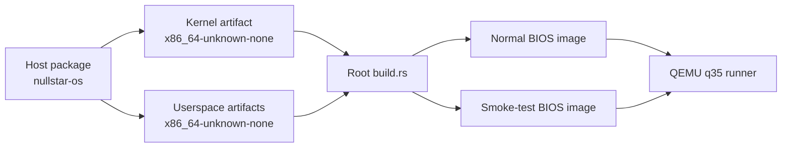

# NullStar OS architecture

This document describes the implemented system as it exists today. It is a
map of the code, not a promise of stable internal APIs.

## Build topology

The repository contains three Cargo packages with two target environments:



The root `nullstar-os` package is a normal host executable. Cargo's unstable
artifact-dependency support builds `kernel` and every declared `userspace`
binary for `x86_64-unknown-none`. The root build script embeds those artifacts,
the boot-mode marker, and test fixtures into images produced by
`bootloader 0.11`.

The generated images contain the same kernel and userspace programs. Their
`/BOOTMODE` file selects one of three paths:

- `normal` initializes services, starts `/init` as PID 1, and lets init launch
  the foreground userspace shell.
- `smoke-test` runs deterministic subsystem probes and emits serial markers for
  the host harness. The persistence test uses two boots of a temporary image.
- `nullfs-restart-test` follows the normal PID 1 path but replaces the mounted
  NullFS service while a probe has a live descriptor and blocked read.

## Boot sequence

The kernel enters through `bootloader_api` with a framebuffer, memory map,
physical-memory mapping, kernel stack, and optional ACPI RSDP address.
Initialization proceeds in dependency order:

1. Create the page-table mapper and physical-frame allocator, then map the
   kernel heap.
2. Parse ACPI data and initialize the framebuffer console.
3. Load the GDT/TSS and IDT, select APIC or legacy PIC interrupt routing, and
   start the LAPIC timer or PIT fallback.
4. Enumerate PCIe through MCFG/ECAM, initialize an AHCI disk, and discover its
   MBR or GPT partitions.
5. Mount the first supported FAT volume at `/`, then mount tmpfs at `/tmp`.
6. Initialize the scheduler and branch into normal, smoke-test, or targeted
   service-fault behavior.
7. On normal and targeted service-fault boots, create PID 1 from `/init`; init
   launches and supervises `/ush`. If init cannot start or later terminates,
   enter the emergency kernel shell.

Serial logging remains available throughout boot, including before the
framebuffer is ready. Fatal early-boot failures report a diagnostic and halt.

## Platform and interrupt layer

Architecture-specific code lives under `kernel/src/arch/x86_64`:

- `gdt.rs` installs kernel/user segments, a TSS, and the double-fault stack.
- `interrupts.rs` owns the IDT, exception paths, hardware IRQ routing, timer
  accounting, keyboard delivery, and the `int 0x80` syscall entry.
- `acpi.rs`, `apic.rs`, and `hpet.rs` validate firmware tables and configure the
  preferred APIC/LAPIC timer path. The PIC and PIT remain fallback paths.

The timer interrupt supplies monotonic ticks and drives scheduler preemption.
The PS/2 keyboard interrupt queues scancodes; decoding and shell work happen
outside IRQ context.

## Memory and scheduling

The kernel uses the bootloader's memory map for 4 KiB physical frames and keeps
reclaimed frames available for reuse. A mapped kernel heap provides dynamic
allocation with aligned splitting and adjacent free-block coalescing.

The scheduler owns bootstrap, kernel-thread, and user-process tasks. Each task
has a kernel stack and saved interrupt context. Timer interrupts can switch
between runnable tasks; blocked processes are made runnable when their I/O,
child, signal, or terminal condition changes. Task-shared kernel state uses a
preemption-aware mutex: hardware interrupts continue, but timer-driven task
switching is deferred until the outermost guard is released. This prevents a
single-CPU task from spinning on a lock whose owner was suspended by the timer.
The preemption depth is global while NullStar remains single-CPU and must become
per-CPU before an SMP scheduler is introduced.

The normal image starts only the services needed for interactive use. Scheduler
stress probes and other destructive checks are restricted to the smoke image.

## Userspace and process lifecycle

Userspace programs are statically linked ELF64 images with custom `_start`
entries from the `userspace` crate. They run in ring 3 with separate page tables
and use software interrupt `0x80` for the NullStar OS syscall ABI. The shared
numeric ABI is defined once in `shared/userspace_abi.rs` and included by both
sides.

Normal boot reserves process identifier 1 for `/init`. Init remains outside the
interactive process group, launches `/ush` as a foreground child group, waits
for shell state changes, restores a stopped shell, and starts a fresh shell
after final exit or signal termination. Direct shell children remain owned and
reaped by `ush`; abandoned descendants continue to use the bounded internal
kernel reaper.

### Future service manager

The intended successor to the current hard-coded init sequence is a declarative,
systemd-inspired service manager implemented by PID 1. NullStar does not intend
to require systemd unit-file compatibility; it should adopt the useful model of
named units, explicit dependencies, readiness, restart policy, and observable
state while keeping the format and capability rules native to NullStar.

Packaged service definitions should live under `/System/services`, matching the
existing system namespace. Future machine-local enablement, overrides, and
drop-ins should live under `/System/config/services` so generated or
administrator-owned policy does not modify packaged definitions. The first
format only needs service units; target-style grouping, timers, sockets, and
other activation types can be added when their lifecycle semantics are defined.

A service definition should eventually describe:

- a stable unit name, executable path, arguments, and environment;
- dependency and ordering relationships without treating ordering as authority;
- restart conditions, backoff, startup timeout, and shutdown timeout;
- the readiness mechanism and whether dependents require readiness or only a
  started process;
- requested capabilities, filesystem access, and delegated service endpoints,
  which PID 1 resolves against policy rather than granting as ambient authority;
- logging destination and resource limits once those facilities exist.

The parser should be versioned, bounded, deterministic, and reject unknown
mandatory fields. Command lines should remain structured argument arrays rather
than being interpreted by a shell. PID 1 must also detect dependency cycles and
report actionable unit failures instead of silently changing startup order.
Services required to make `/System/services` accessible create a bootstrap
cycle; those earliest mounts and service-manager prerequisites must remain in a
small built-in bootstrap set or come from an already available boot image. The
current explicitly coded startup sequence serves as that bootstrap until the
unit loader and dependency engine exist.

The process manager owns:

- address spaces and copy-on-write fork state
- argument and environment blocks
- file-descriptor tables and close-on-exec behavior
- parent/child relationships, process groups, and terminal ownership
- pending, blocked, ignored, default, and handled signal state
- exit, signal, stop, and continue notifications

Final child status is consumable once. Stop/continue transitions are also
one-shot observations. Orphans are adopted by an internal kernel reaper, while
bounded completion history supports diagnostics without retaining live process
resources indefinitely.

`exec` validates and constructs a replacement image before committing it, so a
failed load leaves the original process intact. `fork` initially shares
read-only pages and copies a page when either process writes to it.

## Filesystems and I/O

The storage path is:

```text
PCIe ECAM -> AHCI controller -> block device -> MBR/GPT -> FAT -> VFS
```

FAT12, FAT16, and FAT32 volumes can be read. The current write path is narrower:
it supports regular FAT16 root-directory files with valid 8.3 names and mirrors
updates across FAT copies. `/tmp` is a separate in-memory filesystem used for
temporary files, shell redirection, and tests.

Processes access files, terminals, and pipes through descriptors. Pipes have
bounded buffers and wake blocked readers or writers as state changes. The
terminal tracks a foreground process group so keyboard-generated interrupt and
stop events reach the correct pipeline.

The versioned userspace
[filesystem service protocol](filesystem-service-protocol.md) provides
session-scoped node IDs, directory-relative lookup, request IDs, cancellation,
and registered shared-memory windows. The tmpfs service is the active `/tmp`
data path through that protocol. A separately supervised userspace VFS service
owns a versioned longest-prefix namespace table and validates the mount layout
during boot. `stat`, path-based `read_directory`, `chdir`, descriptor-producing
`open`, and `unlink` cross that routing boundary, including synthetic directory
metadata and merged namespace listings for VFS-owned nodes; other kernel file
operations use the backend recorded by the resulting open-file description.
Service-backed descriptions release one generation- and session-bound node
reference when their final descriptor, stream, or inherited owner disappears,
allowing tmpfs to reclaim unlinked nodes without closing duplicated or
fork-inherited descriptors early.

The rooted namespace includes service-backed `/dev` and `/tmp` mounts, a system
hierarchy under `/System` (`config`, `var/log`, `bin`, `services`, `drivers`,
`lib`, and `Applications`), user homes under `/Users`, and globally installed
applications under `/Applications`. Additional local, removable, and network
filesystems appear as named children of `/Volumes`. The VFS service hides the
implemented mount crossings from clients; preserving broader node and volume
identity remains part of moving routing and open-file ownership out of the
kernel.

NullFS is the native persistent backend for that service architecture, not a
new kernel-resident filesystem implementation. Its shared `no_std` format/core
code is reused by host formatter, image, inspector, checker, and Linux FUSE
tooling. The host implementation supports the version 1.2 inode/directory
format, authoritative allocation maps, bounded data-journaling redo
transactions, persistent orphan recovery, and deterministic crash testing. A
capability-based
[block-device service protocol](block-device-service-protocol.md) gives
init-authorized filesystem services checked, partition-relative,
registered-buffer reads. Boot images include a deterministic,
4096-byte-aligned NullFS partition identified explicitly in the MBR. The
adapter aggregates the endpoint's 512-byte device logical blocks into the
4096-byte blocks required by the shared NullFS core.

A separately supervised, read-only `nullfs-service` mounts that partition. PID
1 registers each service generation as an independent generation-scoped kernel
filesystem proxy, and the VFS statically mounts it at
`/Volumes/NULLSTAR_DATA`. The proxy establishes its own protocol session and
registers one kernel-owned 4 KiB shared-memory buffer. Ordinary `stat`, `open`,
`read`, `fstat`, `seek`, `read_directory`, and `chdir` operations route through
the mount; canonical path handling also makes relative operations resolve
through NullFS after the process changes its cwd into the volume. Write,
create, truncate, append, descriptor-write, and unlink attempts are denied as
read-only.

NullFS node IDs are opaque and scoped to the service session and generation.
Each successful open is retained by the kernel open-file description, so
aliases and inherited descriptors share one service reference; final
description destruction queues one matching `CLOSE_NODE`. On service
replacement, in-flight operations from the old generation fail with I/O, old
descriptors remain stale and fail subsequent NullFS I/O, and stale close
tickets are discarded rather than sent to the replacement session. The direct
protocol probe covers service operations and the normal VFS boot probe covers
the ordinary mounted syscall path. A dedicated restart-test image stops the old
service with a live descriptor, confirms a read is queued, registers a
replacement on a fresh endpoint, and verifies canceled in-flight I/O, stale
`read`/`fstat`/`seek`, and that closing the stale description cannot disrupt a
live new-generation descriptor. Writable NullFS authority still requires an
explicit grant policy and durability validation as described in the
[NullFS roadmap](filesystems/nullfs-roadmap.md).

## Shells

The kernel shell in `kernel/src/shell.rs` is a diagnostic and control surface.
It can inspect initialized subsystems and start or wait for userspace programs,
but normal boot reaches it only as an emergency fallback when init is
unavailable.

The ring-3 `ush` program in `userspace/src/bin/ush.rs` exercises the userspace
ABI. It implements pipelines, descriptor redirection, variables and exported
environments, background jobs, foreground/background transitions, and signal-
based `Ctrl-C`/`Ctrl-Z` handling. PID 1 keeps the machine usable by restarting
`ush` after the shell exits.

## Resource bounds

Bounds are explicit so exhaustion returns a defined error instead of growing
kernel state forever. Important current limits include:

| Resource | Limit |
| --- | ---: |
| Live process slots | 64 |
| Scheduler tasks | 67 |
| Retained completion-history entries | 128 |
| Kernel pipe objects | 32 |
| Open descriptors per process | 16 |
| Arguments per process | 16 |
| Environment variables per process | 16 |
| `ush` pipeline stages | 8 |
| `ush` background jobs | 4 |
| tmpfs files | 32 |
| tmpfs file size | 64 KiB |
| tmpfs total size | 256 KiB |
| NullFS service sessions | 4 |
| NullFS open references per session | 64 |
| NullFS service heap | 2 MiB |
| Kernel NullFS proxy registered buffer | 4 KiB |
| FAT read/write window per file | 1 MiB |

The constants in the implementation remain authoritative. Shared userspace ABI
limits live in `shared/userspace_abi.rs`; subsystem-specific bounds are next to
their owning implementations.

## Verification model

Three layers cover different failure classes:

1. Host-side unit tests exercise target-independent parsing, completion queues,
   and the userspace bump heap.
2. A normal-boot check verifies that production boot reaches the shell without
   executing smoke-only work.
3. The two-boot QEMU smoke suite validates the integrated hardware, storage,
   VFS, scheduler, process, syscall, shell, job-control, and signal paths.

The host runner treats serial markers as contracts and applies a timeout to each
QEMU phase. See [Development](development.md) for the commands.
