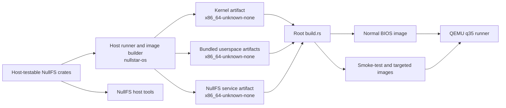

# NullStar OS architecture

This document describes the implemented system as it exists today. It is a map of the
code, not a promise of stable internal APIs. Long-term plans are recorded separately in
[`design/README.md`](design/README.md).

## Build topology

The workspace contains several kinds of Cargo packages across two target environments:

- the root `nullstar-os` host runner and image builder;
- the freestanding `kernel` package;
- the freestanding `userspace` package containing bundled programs;
- the separately packaged freestanding `nullfs-service`;
- host-testable NullFS format, block-device, core, test, and userspace-adapter crates;
- host tools for formatting, imaging, inspecting, checking, and mounting NullFS.



Cargo artifact dependencies build the freestanding packages for
`x86_64-unknown-none`. The root build script embeds those artifacts, boot-mode data,
and fixtures into images produced by `bootloader 0.11`.

Generated images use `/BOOTMODE` to select among:

- `normal`, which starts services, PID 1, and the foreground userspace shell;
- `smoke-test`, which runs deterministic subsystem probes and persistence checks;
- `nullfs-restart-test`, which offlines and replaces the mounted NullFS service while a
  probe owns a live descriptor and blocked read;
- `logging-lifecycle-test`, which validates live logging start/stop/restart, route and
  generation replacement, restart fencing, filesystem mutation policy, and forced termination.

## Boot sequence

The kernel enters through `bootloader_api` with a framebuffer, memory map,
physical-memory mapping, kernel stack, and optional ACPI RSDP address. Initialization
proceeds in dependency order:

1. Create the page-table mapper and physical-frame allocator, then map the kernel heap.
2. Parse ACPI data and initialize the framebuffer console.
3. Load the GDT/TSS and IDT, select APIC or legacy PIC routing, and start the LAPIC timer
   or PIT fallback.
4. Enumerate PCIe through MCFG/ECAM, initialize AHCI, and discover MBR or GPT partitions.
5. Mount the first supported FAT volume at `/`, then establish the service-backed
   namespace including `/tmp` and the bounded writable NullFS mount.
6. Initialize scheduling and select normal, smoke-test, or targeted service-fault
   behavior.
7. Create `/init` as PID 1. Init launches and supervises `/ush`; if init cannot start or
   later terminates, the kernel enters its emergency shell.

Serial logging remains available throughout boot. Fatal early failures report a
diagnostic and halt.

## Platform, interrupts, memory, and scheduling

Architecture-specific code lives under `kernel/src/arch/x86_64`. The GDT/TSS and IDT
provide privilege transitions and exception handling; ACPI, APIC, IOAPIC, HPET, PIC, and
PIT code configure the available interrupt and timer path. The PS/2 interrupt queues
scancodes, while decoding and shell work occur outside hard-interrupt context.

The kernel uses the bootloader memory map for 4 KiB frames and a mapped heap with aligned
splitting and adjacent-block coalescing. The scheduler owns bootstrap, kernel-thread,
and user-process tasks. Timer interrupts preempt runnable tasks, while blocked tasks are
woken for I/O, child, signal, terminal, endpoint, or service completion conditions.

Task-shared state uses a preemption-aware mutex. Interrupts remain enabled, but timer
switching is deferred while the current task owns the outermost guard. Preemption depth
is global while the system is single-CPU and must become per-CPU before SMP.

## Userspace and process lifecycle

Userspace programs are statically linked ELF64 images with custom `_start` entries. They
run in ring 3 with separate page tables and use software interrupt `0x80` for the
experimental NullStar syscall ABI, currently version 1.13. Shared numeric and structure
definitions are included by both kernel and userspace.

PID 1 remains outside the interactive process group, launches `/ush` as a foreground
child group, waits for shell state changes, restores a stopped shell, and starts a fresh
shell after final exit. Direct shell children are reaped by `ush`; abandoned descendants
use the bounded internal kernel reaper.

The process manager owns address spaces and copy-on-write state, arguments and
environments, descriptor tables, parent/child relationships, process groups, terminal
ownership, signals, and completion state. `exec` constructs and validates a replacement
image before committing it, and `fork` initially shares read-only pages before copying
on write.

### Userspace service routes

The allocation-free [service route protocol](service-route-protocol.md) provides the first generic
userspace-managed route layer. `NSRT` v1 uses exact 40-byte request and response records keyed by a
UUIDv4 service ID and nonzero role. The current endpoint ABI permits at most one transferred
capability per message, so a route request carries exactly one fresh send-only reply endpoint and an
accepted response carries exactly one send-only provider ingress; failure responses carry none.

PID 1 is the temporary broker for the logging service ID
`7cbd3f65-50a6-4c30-b195-9fbed633da43`. Producer role `1` and observer role `2` are separate stable
route authorities. The broker authorizes the kernel-stamped caller PID before consulting its
fixed-capacity publication table. It does not parse the NSWP negotiation or logging packets that
clients send directly to the resolved service ingress.

PID 1 owns allocation-free monotonic provider-generation sequences scoped to the stable identities of
logging, NullFS, tmpfs, and VFS. Every startup attempt consumes a generation independently of process
IDs. PID 1 sends that value in a one-use exact 16-byte `NSGN` v1 record over a private bootstrap
endpoint granted to the service with exact `RECEIVE` rights. Each service requires sender PID 1,
exact rights, no attached capability, and a canonical record, then closes the bootstrap handle before
readiness. NullFS and tmpfs use the value in filesystem sessions, PID 1 uses the same value for kernel
proxy registration, and logging uses it consistently for its collector, `NSLS`, NSWP, and route
publications. The current contract provides no durable cross-boot persistence; a restartable service
manager must eventually own and receive each sequence's state.

Each generation uses fresh producer and observer ingress endpoint objects. Fresh objects prevent old
clients from reaching the replacement, but they cannot revoke all handles to the old objects.
Retained old-generation handles and per-resolution reply objects also consume the current global
limit of 32 live endpoint objects, so route setup can fail under endpoint pressure.

The broker never replays service traffic. In particular, a one-way logging `Emit` whose processing
became uncertain during failure is not submitted again automatically to a replacement generation.

### Native service control

The allocation-free [service control protocol](service-control-protocol.md) defines the host-testable
`NSVC` v1 codec and its native endpoint adapter. Wire requests and responses remain exactly 64 bytes.
Each native request transfers one fresh exact-`SEND` private reply endpoint; the correlated response
carries no capability and must come from a nonzero kernel-stamped server PID.

PID 1 temporarily owns separate stable observation and mutation ingresses for its hard-coded
`logging`, `nullfs`, `tmpfs`, and `vfs` services. Exact-`SEND` observation authority permits `/sv
list` and `/sv status SERVICE`; mutation packets on that endpoint receive `AccessDenied`. Separate
mutation authority permits `/sv restart SERVICE` and live `/sv start logging` and `/sv stop
logging`; filesystem `Start` and `Stop` remain `Unsupported`.

A committed restart reports the old generation as `Terminating`, uses no failure backoff or restart
budget, and assigns the replacement's next manager-owned generation. Restart intent remains pending
through replacement startup, so queued duplicate requests receive `Busy` rather than restarting the
new generation. A missing reply after send is outcome unknown and is never retried automatically. The trusted shell holds only `SEND | DUPLICATE`
for each authority, not `TRANSFER`; arbitrary children and pathname-selected executables inherit
neither.

Logging is the first live desired-state convergence pilot. PID 1 processes logging child events,
mutation requests, readiness, and backoff in bounded steps; stop withdraws producer and observer
routes before later resolutions are serviced, and start publishes only a fresh ready generation.
A bounded readiness deadline force-terminates a starting child that never declares readiness, after
which ordinary restart/backoff limits apply. Controlled stop does not charge failure policy, and
start/stop success commits desired state without
waiting for exit or readiness. PID 1 first requests cooperative termination and escalates after a
bounded grace period with uncatchable, unblockable signal 9; the dedicated lifecycle image verifies
that escalation, duplicate-restart `Busy`, and exact filesystem `Start`/`Stop` `Unsupported` policy.
Filesystem restart now waits for final child status, offlines the exact old generation through the
PID-1-only ABI 1.13 syscall, fails and wakes that generation's blocked proxy work with `EIO`, closes
the old endpoint handle, creates a fresh endpoint object, and starts and registers a strictly newer
generation before completing the restart fence. The kernel preserves an offline generation tombstone,
rejects stale replies and work, and purges stale close work. Writable NullFS remains online until final
exit because orderly pre-exit quiesce and `SYNC` remain future work. Filesystem `Start` and `Stop`
therefore remain exactly `Unsupported`; `NSVC` v1 is unchanged. This adds no manager process,
activation, definition loading, or cross-reboot persistence.

### Future service and session lifecycle

The current init sequence and service launch policy are explicitly coded into PID 1. The
accepted successor separates two roles:

- a small PID 1 bootstrap and recovery supervisor that establishes the root job, starts
  and monitors the service manager, and retains only emergency authority;
- a separately restartable system service manager that owns ordinary definitions,
  dependencies, channel activation, readiness, restart policy, resource limits,
  capability routing, structured logging integration, and top-level session creation.

Packaged definitions belong under `/System/services`; machine enablement and overrides
belong under `/System/config/services`. Commands remain structured argument arrays, not
shell strings. Bootstrap services needed to make `/System/services` available remain in
a small independently available set.

Successful login eventually creates a dedicated session job managed by a per-session
manager. The session manager, rather than PID 1, owns that user's compositor, desktop
shell, session services, application jobs, logout, and lock lifecycle.

See [Service, session, and application lifecycle](design/service-and-session-lifecycle.md)
and [Service management and command-line direction](design/service-management-and-cli.md)
for the accepted design rather than treating this current-system document as its full
specification.

### Future identity and access control

The future multiuser model adds authenticated process credentials, UID/GID/mode checks,
supplementary groups, sessions, and service identities. UID 0 may receive a narrow
discretionary-access override, and the `admin` group may authorize brokered elevation,
but neither identity manufactures kernel capabilities. See
[Identity and access-control design](identity-and-access.md).

## Filesystems and I/O

The bootstrap storage path is:

```text
PCIe ECAM -> AHCI controller -> block device -> MBR/GPT -> FAT -> VFS
```

FAT12, FAT16, and FAT32 can be read. FAT writes remain limited to regular FAT16
root-directory files with valid 8.3 names and a bounded per-file window.

Processes access files, terminals, and pipes through descriptors. Pipes have bounded
buffers and wake blocked readers or writers. The terminal tracks a foreground process
group so generated interrupt and stop events reach the correct job.

The versioned [filesystem service protocol](filesystem-service-protocol.md) provides
sessions, opaque node IDs, directory-relative lookup, request IDs, cancellation, and
registered shared-memory windows. The userspace tmpfs service is the active `/tmp` data
path. A separately supervised VFS service owns the longest-prefix namespace table and
validates the layout during boot.

`stat`, path-based `read_directory`, `chdir`, descriptor-producing `open`, descriptor
`read` and `write`, and `unlink` cross the VFS routing boundary. Service-backed open-file
descriptions retain exactly one generation- and session-bound node reference until their
final shared owner disappears.

The rooted namespace currently includes synthetic `/dev`, service-backed `/tmp`, the
system hierarchy under `/System`, homes under `/Users`, applications under
`/Applications`, and named filesystems below `/Volumes`. The implemented mount layout is
not the accepted final physical-storage layout; see
[Filesystem namespace and boot direction](design/filesystem-namespace.md).

### Future device filesystem and drivers

The current synthetic `/dev` namespace is intended to become a userspace `devfs-service`
registry and connection broker. Device paths expose metadata, while successful opens
create attenuated provider-generation sessions. Kernel-backed adapters can precede
userspace hardware drivers. See [Device filesystem design](devfs.md) and
[Driver model](design/driver-model.md).

### NullFS service

NullFS is a userspace persistent-filesystem backend, not a new kernel-resident
filesystem. Shared `no_std` format and core code is reused by the formatter, image
builder, inspector, checker, FUSE adapter, and NullStar service.

The host implementation supports format version 1.2, authoritative allocation maps,
bounded redo recovery, persistent orphan recovery, writable host operation, and
deterministic crash testing. The kernel exposes checked, partition-relative read-only
endpoints for discovered filesystem candidates and separately generated writable
endpoints only for validated NullFS partitions. PID 1 acquires primary-volume authority by
an exact configured filesystem UUID; the kernel requires exactly one eligible match and
never falls back to partition order or label. PID 1 alone acquires those objects and
delegates ordinary send-only endpoint handles; endpoint identity, not path, discovery,
label, or UID, carries raw write authority.

PID 1 explicitly launches the supervised service as `/nullfs-service --writable` and
delegates a partition-scoped raw endpoint advertising exactly the required
`READ | WRITE | FLUSH` operations. The service mounts `nullfs-core` read-write. Mounting
performs journal recovery, orphan reclamation, full-volume validation, and dirty-state
publication before the service announces readiness, so registration never exposes a
pre-recovery filesystem.

Raw block authority, writable filesystem-session authority, and public VFS authority are
separate boundaries. A generic filesystem `CONNECT` with flags `0` creates a read-only
session; exactly `WRITE` creates a writable session and returns the `WRITE` feature. The
service rejects unsupported combinations rather than silently downgrading them. Explicit
direct writable clients can create files and directories, write or append at most 4 KiB
per request from a registered buffer copied into private memory, truncate, unlink,
`rmdir`, rename using a registered-buffer destination name, and sync. New files and
directories use modes `0644` and `0755`. Every mutation rechecks the session's writable
feature.

Mutation failures whose durable outcome cannot be proven return `OUTCOME_UNKNOWN`; the
service then fail-stops so supervision can restart it and remount through normal
recovery. Clients must not automatically retry an uncertain operation. Open-unlinked
access is accepted only through an actual matching open handle. Unlink is rejected when
a read-only session owns an open whose later close would reclaim storage, and open-
directory `rmdir` and unsafe rename replacement remain restricted.

The kernel NullFS proxy requests exactly `WRITE` and accepts a service generation only
when `CONNECT` returns `session_features::WRITE`. The public `/Volumes/NullStar`
mount supports ordinary `stat`, read, open, `fstat`, seek, directory reads, and `chdir`,
plus writable, create, truncate, and append opens, descriptor writes, and unlink. Public
`mkdir`, `rmdir`, rename, and broader namespace adoption remain future work; direct
flags-zero sessions remain read-only.

The proxy reserves its single request before staging at most 4 KiB for a write. A
successful generic `WRITE` reply retains the byte count in `value` and carries the exact
authoritative resulting offset as eight little-endian inline bytes, including the EOF
selected by append. Open descriptions for the same generation-, session-, and node-bound
file share size state, preserving append, truncate, cross-handle `fstat`/`SEEK_END`, and
open-unlinked coherence. Exact-generation offlining fails and wakes blocked old work,
purges stale close work, and never replays or rebinds old descriptions; they remain stale.
The retained tombstone permits replacement registration only with a strictly newer
generation and a fresh endpoint object.

The public proxy validates canonical replies. `OUTCOME_UNKNOWN`, a malformed reply, or
post-send uncertainty about a mutation maps to `IO`, quarantines that service
generation, and is never automatically retried. These rules do not add durability beyond
NullFS's existing transaction and recovery semantics.

Normal boot retains raw read-only coverage plus non-destructive writable-endpoint
identity, bounds, and flush checks. Filesystem-level probes provide durable mutation
coverage without using allocatable file data as raw scratch space.
The generated 4 MiB primary volume is exposed at `/Volumes/NullStar` and contains
`System/`, `Applications/`, and `Users/`, but those trees are not yet bound into the root
namespace. Public probes cover create, write, independent stale append, cross-handle
`fstat` and `SEEK_END`, truncate, descriptor duplication, unlink while open,
open-unlinked read and write, cleanup, persistence across service restart, and stale old
descriptors. Namespace bindings are the next integration work described in the
[NullFS roadmap](filesystems/nullfs-roadmap.md).

## Shells

The kernel shell is an emergency diagnostic and control surface. The ring-3 `ush` shell
implements pipelines, descriptor redirection, variables, exported environments,
background jobs, foreground/background transitions, and signal-based job control. PID 1
restarts it after exit.

## Resource bounds

Bounds are explicit so exhaustion returns defined errors. Important current limits
include 64 live process slots, 67 scheduler tasks, 128 retained completion records, 32
kernel pipes, 64 capabilities per process, 32 live endpoint objects system-wide, eight messages per
endpoint, 16 descriptors per process, 16 arguments, 16 environment variables, eight pipeline stages,
four background jobs, 32 tmpfs files, 64 KiB per tmpfs file, 256 KiB of total tmpfs data, four NullFS
sessions, 64 NullFS open references per session, a 2 MiB NullFS-service heap, and a 4 KiB registered
proxy buffer. Implementation constants remain authoritative.

## Verification model

Verification has three layers:

1. host-side tests for target-independent parsing, state machines, and filesystem code;
2. a normal-boot readiness check that reaches PID 1 and the userspace shell;
3. QEMU smoke and targeted fault tests covering hardware, storage, VFS, scheduling,
   processes, syscalls, shell behavior, persistence, and service replacement.

Serial markers are integration contracts. See [Development](development.md) for the
current commands.
