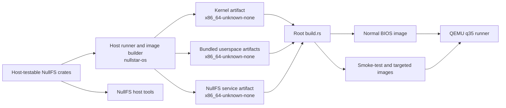

# NullStar OS architecture

This document describes the implemented system as it exists today. It is a map of the
code, not a promise of stable internal APIs. Long-term plans are recorded separately in
[`design/README.md`](design/README.md).

## Build topology

The workspace contains several kinds of Cargo packages across two target environments:

- the root `nullstar-os` host runner and image builder;
- the freestanding `kernel` package;
- the freestanding `userspace` package containing bundled programs;
- the separately packaged freestanding `nullfs-service`;
- host-testable NullFS format, block-device, core, test, and userspace-adapter crates;
- host tools for formatting, imaging, inspecting, checking, and mounting NullFS.



Cargo artifact dependencies build the freestanding packages for
`x86_64-unknown-none`. The root build script embeds those artifacts, boot-mode data,
and fixtures into images produced by `bootloader 0.11`.

Generated images use `/BOOTMODE` to select among:

- `normal`, which starts services, PID 1, and the foreground userspace shell;
- `smoke-test`, which runs deterministic subsystem probes and persistence checks;
- `nullfs-restart-test`, which validates NullFS's clean quiesce/unmount replacement and a
  stopped-service timeout/whole-job KILL replacement through dirty recovery, including escaped
  descendants and complete job drainage;
- `nullfs-out-of-space-test`, whose offline-built fixture has zero free inodes and data blocks and
  validates exact public-ABI exhaustion, service continuity, reclamation, and later mutation;
- `nullfs-block-device-loss-test`, which validates exact raw-provider offlining, uncertain-mutation
  fail-stop, escaped-descendant job drainage, stale filesystem generations, and bootstrap continuity;
- `nullfs-crash-recovery-test`, which crashes the service after a durable public mutation but before
  its reply and validates exact-generation offlining, escaped-descendant job drainage, dirty remount,
  and non-retried recovery;
- `nullfs-unavailable-test`, whose image omits the primary NullFS partition and validates exact
  UUID lookup failure plus handoff to the independently available emergency kernel shell;
- `logging-lifecycle-test`, which validates live logging start/stop/restart, route and
  generation replacement, restart fencing, filesystem mutation policy, forced termination,
  readiness-timeout drainage, and tmpfs/VFS escaped-process-group descendant termination,
  whole-job drainage, and generation replacement.

## Boot sequence

The kernel enters through `bootloader_api` with a framebuffer, memory map,
physical-memory mapping, kernel stack, and optional ACPI RSDP address. Initialization
proceeds in dependency order:

1. Create the page-table mapper and physical-frame allocator, then map the kernel heap.
2. Parse ACPI data and initialize the framebuffer console.
3. Load the GDT/TSS and IDT, select APIC or legacy PIC routing, and start the LAPIC timer
   or PIT fallback.
4. Enumerate PCIe through MCFG/ECAM, initialize AHCI, and discover MBR or GPT partitions.
5. Mount the first supported FAT volume at `/`, then establish the service-backed
   namespace including `/tmp` and the bounded writable NullFS mount.
6. Initialize scheduling and select normal, smoke-test, or targeted service-fault
   behavior.
7. Create `/init` as PID 1. Init launches and supervises `/ush`; if init cannot start or
   later terminates, the kernel enters its emergency shell.

Serial logging remains available throughout boot. Fatal early failures report a
diagnostic and halt.

## Platform, interrupts, memory, and scheduling

Architecture-specific code lives under `kernel/src/arch/x86_64`. The GDT/TSS and IDT
provide privilege transitions and exception handling; ACPI, APIC, IOAPIC, HPET, PIC, and
PIT code configure the available interrupt and timer path. The PS/2 interrupt queues
scancodes, while decoding and shell work occur outside hard-interrupt context.

The kernel uses the bootloader memory map for 4 KiB frames and a mapped heap with aligned
splitting and adjacent-block coalescing. The scheduler owns bootstrap, kernel-thread,
and user-process tasks. Timer interrupts preempt runnable tasks, while blocked tasks are
woken for I/O, child, signal, terminal, endpoint, or service completion conditions.

Task-shared state uses a preemption-aware mutex. Interrupts remain enabled, but timer
switching is deferred while the current task owns the outermost guard. Preemption depth
is tracked per CPU so bootstrap and application-processor scheduler lanes defer
independently while holding kernel locks.

The kernel also exposes a bounded, architecture-neutral process/thread lifecycle model.
Processes own parent/child hierarchy and exit state; threads own schedulable lifecycle
state, independent identities, join/detach policy, and exit records. The model is
host-testable. `SmpExecution` now owns a process table and SMP policy together, prevalidates
admission, and applies dispatch, yield, block, sleep, wake, stop, continue, migration, rebalance,
exit, detach, join, and reap transitions without exposing independent mutable state. Queue
admission and migration report their source and destination dispatch effects so lifecycle
`Running` state stays synchronized across CPUs. A kernel-wide `ExecutionRuntime` now owns the one
live coordinator shared by architecture context stores. It initializes with CPU 0 online, keeps
fixed topology capacity separate from the actual online mask, assigns architecture-owned thread
identities from one reserved namespace, and admits each CPU's context group transactionally.
The bounded registry now retains 128 processes and 256 threads/queue assignments. At the 64-CPU
topology limit it covers 131 AP contexts, the three CPU 0 smoke-test contexts, and 64 userspace
compatibility processes: 128 process identities and 198 thread assignments in total.
Automatically allocated userspace-facing thread identities remain in the low namespace and cannot
collide with reserved high-range architecture identities.
Application-processor kernel contexts and the CPU 0 bootstrap scheduler now use this runtime. The
bootstrap, smoke-test kernel contexts, and every single-thread-per-process userspace task retain
their architecture register/address-space storage in the CPU 0 scheduler while all admission,
timer rotation, yield, block, wake, stop, continue, exit, and reap transitions flow through the
shared lifecycle and queue owner. Userspace admission is transactional, records shared parent/child
identity separately from compatibility PIDs, and preserves deferred wake state when a blocked task
is stopped. General multi-threaded userspace creation still needs an ABI and context-store path.

The single-CPU scheduling milestone now shares that thread-state vocabulary and provides
a bounded round-robin policy model. Timer ticks consume a configured quantum, rotate
runnable threads, and record preemptions; explicit yield, block, wake, and removal paths
use the same queue and preserve deterministic switch accounting. The architecture-specific
interrupt scheduler remains responsible for register contexts and address spaces.

The SMP foundation retains bounded processor identities from the ACPI MADT, starts application
processors with per-CPU GDT/TSS, interrupt, timer, preemption, and scheduler state, and exposes
an affinity-aware per-CPU round-robin policy model. `SmpRoundRobin` validates online CPU masks,
balances unrestricted threads, and supports explicit affinity changes, live context migration,
blocking, waking, yielding, removal, and deterministic rebalance planning. Blocked assignments
retain their thread identity, CPU ownership, and affinity without contributing runnable load.
Wakeup prefers the previous CPU while its eligible load remains within one runnable thread of
the least-loaded allowed CPU; otherwise it migrates ownership before queueing the thread. A
single AP timer coordinator evaluates rebalance plans at a bounded interval after releasing its
local scheduler lock; one migration is dispatched through a reschedule IPI and verified when the
destination scheduler selects the transferred context. Repeated passes converge larger
imbalances one move at a time and retain bounded check, request, completion, and delivery-failure
counters. Each live AP owns a bounded lifecycle process whose reserved probe identities are
registered through the shared execution runtime; timer rotation, migration, rebalance, block, and
wake paths update lifecycle and queue state under the same coordinator. Failed context-group
admission rolls back its process, threads, and queue assignments before publication. QEMU acceptance
records the incremental online CPU mask and registered context-group count alongside nonzero AP
process identities and expected thread/running counts, blocks a live context, transfers it between
CPU-local task stores during wakeup, and verifies both destination dispatch and lifecycle state.
Ordinary userspace tasks remain physically hosted by the bootstrap context/address-space store, but
their lifecycle identity and CPU 0 queue decisions now come from the same execution runtime as AP
kernel contexts. This compatibility cutover deliberately leaves register storage CPU-local while
removing the second independent source of scheduling truth. Generic object, wait-set, event-port,
timer, and endpoint waits capture that exact execution identity when blocking and wake the recorded
thread through the shared runtime. Capability ownership and process teardown still use compatibility
process IDs, but independent threads in one process no longer overwrite one another's waiter records.

The synchronization/IPC layer adds an acquire/release `SmpMutex`, bounded FIFO channels with
blocking and nonblocking operations, and fixed per-CPU mailboxes for reschedule, wake, address-space
invalidation, and process-signal messages. Mailboxes validate both endpoints against the discovered
online mask, preserve source and target identities, remain FIFO under contention, and drain queued
messages before close. APIC delivery and interrupt-side draining are still hardware integration work;
the host-testable ownership and queue semantics are established here first.

The memory milestone adds a bounded `AddressSpaceTable` model for process-owned virtual address
spaces. It validates canonical page alignment and W^X permissions, tracks physical-frame references
across isolated mappings, supports map/unmap/protect operations, and models fork-style copy-on-write
sharing plus fault-time replacement. The existing x86 page-table loader remains the hardware-facing
mapper; this shared model makes ownership and isolation rules explicit before page-fault and TLB
shootdown integration.

The capability milestone adds a shared bounded `CapabilityRegistry` over the kernel object
vocabulary. Process tables use generation-checked handles, object-type validation, rights
attenuation for duplication and transfer, and explicit global revocation. Closing a handle advances
its generation so stale tokens cannot be reused, while object records are reclaimed after their last
authority disappears. The existing userspace capability ABI remains compatible while services
incrementally adopt these common authority rules.

The containment milestone adds an ancestor-accounted `ContainmentTree` for job/process policy.
Each process reservation is charged to its job and every parent, effective limits are checked before
admission or usage growth, and limits can only tighten without invalidating current usage. Subtree
termination releases all reservations before retiring descendants, so memory, thread, handle, CPU,
and process accounting cannot leak across job boundaries. The existing job exit queue remains the
per-object completion mechanism while this tree supplies hierarchy-wide resource policy.

The interrupt milestone adds a bounded `InterruptRouter` and `InterruptTimerQueue` policy layer.
Vector registration is explicit and duplicate timer/syscall routes are rejected; dispatch validates
that the delivered event matches its registered route and records unhandled or mismatched delivery.
Exception classification applies a context-aware policy: user faults terminate the current task,
kernel faults panic, breakpoints resume, and double faults halt. Timer deadlines are monotonic,
capacity-bounded, deterministic, and support one-shot or periodic operation with missed ticks
coalesced into one delivery. The x86 IDT/APIC/PIT code remains the hardware integration boundary;
this layer supplies the bounded policy and testable state transitions that interrupt handlers consume.

## Userspace and process lifecycle

Userspace programs are statically linked ELF64 images with custom `_start` entries. They
run in ring 3 with separate page tables and use software interrupt `0x80` for the
experimental NullStar syscall ABI, currently version 1.30. Shared numeric and structure
definitions are included by both kernel and userspace.

The userspace library preserves raw numeric capability calls for compatibility and now layers
non-cloneable ownership-safe handles over them. Owned handles close on drop, borrowed handles are
lifetime-bound, object markers preserve validated endpoint, notification, shared-memory, early-log,
job, wait-set, event-port, timer, and manual-reset event kinds, and explicit operations cover duplication, rights replacement, raw ownership
transfer, type erasure, and revalidation. The first typed endpoint receive path adopts attached
capabilities immediately so ignored attachments are closed automatically. Typed endpoint move sends
consume their sources only after a successful atomic enqueue and return every owned handle on failure,
making backpressure retries explicit and leak-free. A scoped, allocation-free reactor now drives
standard Rust futures for endpoint send, receive, and ownership-consuming single- or multi-handle move send over the bounded
many-object wait ABI. It sleeps in the scheduler after backpressure rather than polling and preserves
move-send ownership across every pending or failed registration path. Atomic channel-pair creation now
provides bidirectional peer queues, writable state based on peer capacity, final-reference peer closure,
and queued-message drainage after closure. ABI 1.26 adds all-or-nothing messages carrying up to four
rights-reduced moved handles, including required-capacity reporting without dequeue. ABI 1.27 adds
bounded persistent wait sets with tagged, insertion-ordered, level-triggered registrations and typed
userspace ownership. ABI 1.28 adds bounded queued event ports with FIFO rising-edge delivery,
per-key coalescing, explicit rearming, and the same typed ownership and delegation rules. ABI 1.29
adds capability-backed one-shot monotonic timers that feed generic waits, wait sets, and event ports.
ABI 1.30 adds user-controlled manual-reset events with persistent `SIGNALED` state and the same
generic wait, wait-set, event-port, typed ownership, and delegation paths.
The scoped reactor now carries one absolute deadline plus a bounded event-backed cancellation lineage
through every wait, and rearms one-shot timers into periodic schedules with explicit missed-tick
coalescing. A fixed-capacity executor assigns generation-tagged event-port registrations to independent
tasks, polls only selected task slots, and gives every task fixed-depth role attribution plus inherited
ancestor cancellation and deadlines. A distinct cooperative shutdown signal lets the executor drain
until one absolute deadline and records any remaining task as a shutdown timeout. A fixed 64-record
lifecycle ring traces spawn, poll, wait, wake, terminal, and reap transitions with sequence cursors and
explicit overwrite counts. Generic typed readiness, counted-notification consumption, and hierarchical
job-exit futures now use the same bounded reactor and event-port route. An allocation-free blocking-work
coordinator provides fixed FIFO admission, logical worker bounds, inherited task-group cancellation and
deadline checks before execution, queued cancellation, shutdown conversion, retained outcomes, and a
bounded trace. It does not create threads or preempt callbacks that have begun; those guarantees require
the future thread/address-space and job-resource-policy substrate. Role-specific process contexts own explicit capabilities, reject duplicate
roles, validate claimed object kinds, and irreversibly tighten authority to the consumer's requested
rights. Provisional protocol descriptors bound names, versions, message sizes, and handle counts;
client/server service bindings pair those declarations with typed endpoint ownership. The runtime probe
checks these rules, typed notification and job-exit completions, process-exit cleanup, real cross-process wakeups, interrupt-driven timer delivery,
periodic rearming, ancestor cancellation isolation, deadline termination, trace ordering, rights
tightening, blocking-work lifecycle policy, and bounded shutdown against kernel handles. An `NSPD`
companion codec fragments descriptive process-start identity, structured arguments, compatibility
environment, and launch metadata across bounded messages, assembles them into caller-owned fixed
storage, and rejects gaps, reordering, malformed sections, and unsupported required extensions. Its
namespace-profile and executable identities are data rather than authority; validated `NSPC`
capabilities remain the authority boundary. The definition-backed service, logging, NullFS, tmpfs, and VFS now use
the live bootstrap-channel path. PID 1 moves their role-tagged capabilities in `NSPC`, follows with
the required `NSPD` sections and `NSPX` end record, and releases the launch barrier only after the
complete stream is queued. A shared service receiver requires bootstrap handle 1 to be the only
initial capability, pins PID 1, validates identity and legacy-stack argument agreement, and adopts
capabilities by semantic role for logging, NullFS, tmpfs, and VFS. Logging's transfer-only kernel early-log
reader and NullFS's transfer-only writable block-device endpoint are moved into each startup envelope
and reacquired by PID 1 for every later generation. The ordinary shell launcher now gives each
single-command and pipeline child a private internal barrier, installs one receive-only bootstrap
handle, and queues a capability-empty tool `NSPC` plus complete `NSPD`/`NSPX` stream before release.
Before installation, a child-to-parent handshake confirms that the child discarded every capability
inherited by `fork`, preventing a grant race and making the empty initial table structural rather
than dependent on the launcher having no authority.
Converted bundled tools authenticate their parent and validate canonical executable identity,
arguments, compatibility environment, and the absence of ambient capabilities before program entry.
PID 1 now uses the same descriptive stream with typed capability attachments for `sv`, `logctl`, and
its foreground `ush`: the child receives only bootstrap handle 1 before release, then adopts logging
observer and service-control observation/mutation authority by semantic role and exact rights.
The external `exec` launcher also stages the stream on its own receive-only handle 1 before image
replacement; the replacement accepts the same PID only when the authenticated exec flag is present.
All bundled exec probes now exercise that path, including CWD-relative canonicalization, repeated
failed replacement cleanup, descriptor preservation, signal state, and explicit discard of
no-longer-needed inherited capabilities. The kernel smoke-test launch of `ush` remains an explicit
mixed-launch compatibility entry; PID 1's remaining filesystem and fault-injection probe launchers, additional I/O event sources,
sender-side receiver-slot reservation, generated bindings, and parallel isolated blocking workers
remain future migration work.

PID 1 remains outside the interactive process group, launches `/ush` as a foreground
child group, waits for shell state changes, restores a stopped shell, and starts a fresh
shell after final exit. Direct shell children are reaped by `ush`; abandoned descendants
use the bounded internal kernel reaper.

The process manager owns address spaces and copy-on-write state, arguments and
environments, descriptor tables, parent/child relationships, process groups, basic job
membership, terminal ownership, signals, and completion state. `exec` constructs and
validates a replacement image before committing it, and `fork` initially shares read-only
pages before copying on write. Capability-backed jobs provide immutable child hierarchy,
leaf-local descendant containment, deterministic subtree exit observation, and whole-subtree
forced termination. Tightening-only process ceilings apply to a job's complete subtree and every
ancestor during assignment and inherited process creation, and `WAIT` authority can inspect each
job's configured local ceiling. A manager may permanently retire and
detach an empty child leaf so bounded hierarchies can reclaim completed generations. PID 1
uses fresh jobs for policy-pinned definition-backed service attempts and every logging,
NullFS, tmpfs, and VFS generation before launch-barrier release, retains only `SIGNAL | WAIT`, and drains each
generation to `ECHILD` before replacement. PID 1 still uses one flat job per service
generation. The application launch layer separately retains each application job for root-pinned
readiness, bounded relaunch, complete drainage, and explicit user/session teardown; standalone
session-manager and resource-policy integration remain future work. NullFS
preserves its exact quiesce and clean-unmount durability proof before job drainage;
failure paths terminate and drain the job before dirty recovery. Shared PID 1 cleanup now
uses allocation-free result classification and canonical bootstrap diagnostics for unexpected
signal, wait, job, capability-close, launch-barrier, yield, and budget-exhaustion outcomes.

### Userspace service routes

The allocation-free [service route protocol](service-route-protocol.md) provides the first generic
userspace-managed route layer. `NSRT` v1 uses exact 40-byte request and response records keyed by a
UUIDv4 service ID and nonzero role. The protocol deliberately uses one transferred
capability per message: a route request carries exactly one fresh send-only reply endpoint and an
accepted response carries exactly one send-only provider ingress; failure responses carry none.

Desktop applications receive a separate restricted NSRT namespace endpoint. Its immutable baseline
allowlist covers display, application lifecycle, settings, logging production, audio playback, and
portals. Namespace policy rejects other keys before route publication is consulted; allowed routes
still cross caller authorization and resolve through the same generation-aware table.

The [application permission-store foundation](design/application-permission-store.md) defines the
policy identity beneath file and directory portals. Fixed-capacity `NSPG` v1 records bind one verified
application installation to a filesystem UUID, object ID, object generation, resource kind, rights,
and scope. One-shot consumption and explicit revocation retain revisioned tombstones; strict
checkpoint loading rejects stale counters and duplicate active grants. The current layer does not yet
restore those identities into live filesystem authority or persist a transactional checkpoint.

The [application filesystem resource resolver](design/application-resource-resolution.md) adds
optional filesystem protocol operation `RESOLVE_IDENTITY`. NullFS resolves a generation-scoped opaque
node to its selected-superblock UUID and validated inode number, inode generation, and kind. The
application adapter pins an independently expected UUID, rejects symbolic links and kind
substitution, and then constructs the permission identity. Tmpfs returns `NOT_SUPPORTED`; no provider
can gain persistence merely by returning an opaque node ID.

The [application portal admission foundation](design/application-portal-admission.md) adds canonical
open, save, and directory-selection messages plus authenticated one-shot gesture admission. A ticket
is accepted only from the configured kernel-stamped gesture issuer and binds the client process,
verified installation, user session, parent surface, seat event, and a bounded lifetime. Selected
responses must match the admitted subject, resource kind, rights, and scope and carry exactly one
capability. The compositor transport, picker, and endpoint adapter remain future layers.

PID 1 is the temporary broker for the logging service ID
`7cbd3f65-50a6-4c30-b195-9fbed633da43`. Producer role `1` and observer role `2` are separate stable
route authorities. The broker authorizes the kernel-stamped caller PID before consulting its
fixed-capacity publication table. It does not parse the NSWP negotiation or logging packets that
clients send directly to the resolved service ingress.

PID 1 owns allocation-free monotonic provider-generation sequences scoped to the stable identities of
logging, NullFS, tmpfs, and VFS. Every startup attempt consumes a generation independently of process
IDs. All four services obtain it from the manager-generation field of the complete `NSPD` stream
after pinning PID 1 on their single bootstrap channel; they no longer receive a generation endpoint.
NullFS and tmpfs use the value in filesystem sessions, PID 1 uses the same value for kernel
proxy registration, and logging uses it consistently for its collector, `NSLS`, NSWP, and route
publications. The current contract provides no durable cross-boot persistence; a restartable service
manager must eventually own and receive each sequence's state.

Each generation uses fresh producer and observer ingress endpoint objects. Fresh objects prevent old
clients from reaching the replacement, but they cannot revoke all handles to the old objects.
Retained old-generation handles and per-resolution reply objects also consume the current global
limit of 32 live endpoint objects, so route setup can fail under endpoint pressure.

The broker never replays service traffic. In particular, a one-way logging `Emit` whose processing
became uncertain during failure is not submitted again automatically to a replacement generation.

### Native service control

The allocation-free [service control protocol](service-control-protocol.md) defines the host-testable
`NSVC` v1 codec and its native endpoint adapter. Wire requests and responses remain exactly 64 bytes.
Each native request transfers one fresh exact-`SEND` private reply endpoint; the correlated response
carries no capability and must come from a nonzero kernel-stamped server PID.

PID 1 temporarily owns separate stable observation and mutation ingresses for its hard-coded
`logging`, `nullfs`, `tmpfs`, and `vfs` services. Exact-`SEND` observation authority permits `/sv
list` and `/sv status SERVICE`; mutation packets on that endpoint receive `AccessDenied`. Separate
mutation authority permits `/sv restart SERVICE` and live `/sv start logging` and `/sv stop
logging`; filesystem `Start` and `Stop` remain `Unsupported`.

A committed restart reports the old generation as `Terminating`, uses no failure backoff or restart
budget, and assigns the replacement's next manager-owned generation. Restart intent remains pending
through replacement startup, so queued duplicate requests receive `Busy` rather than restarting the
new generation. A missing reply after send is outcome unknown and is never retried automatically. The trusted shell holds only `SEND | DUPLICATE`
for each authority, not `TRANSFER`; arbitrary children and pathname-selected executables inherit
neither.

Logging is the first live desired-state convergence pilot. PID 1 processes logging child events,
mutation requests, readiness, and backoff in bounded steps; stop withdraws producer and observer
routes before later resolutions are serviced, and start publishes only a fresh ready generation.
A bounded readiness deadline force-terminates a starting generation that never declares readiness,
after which ordinary restart/backoff limits apply. Each logging attempt is assigned to a fresh flat
job before barrier release; PID 1 retains only `SIGNAL | WAIT`, consumes the direct leader status for
policy, and drains the job to `ECHILD` before endpoint closure or replacement. Controlled stop does
not charge failure policy, and start/stop success commits desired state without waiting for exit or
readiness. PID 1 first requests cooperative process-group termination and escalates the whole job
after a bounded grace period with uncatchable, unblockable signal 9; the dedicated lifecycle image
verifies escaped-descendant cleanup, that escalation, duplicate-restart `Busy`, and exact filesystem
`Start`/`Stop` `Unsupported` policy. Policy-pinned definition-backed service attempts and every tmpfs and VFS
generation also receive a fresh flat job before launch-barrier release; PID 1 retains only
`SIGNAL | WAIT` and drains the complete generation to `ECHILD` before replacement. The lifecycle
gate injects tmpfs/VFS descendants that escape their leaders' process groups and requires descendant
termination, whole-job drainage to `ECHILD`, and generation replacement.
Controlled NullFS restart queues private `NFLC` v1 `QUIESCE` behind earlier FIFO requests. Exact
`QUIESCED` lets PID 1 offline that provider generation and wake tail work with `EIO`; `UNMOUNT` then
closes core handles, syncs and publishes a clean superblock, emits exact `CLEAN_UNMOUNTED`, and exits
`0`. Only that exact event plus final exit `0` proves the clean path. Timeout, malformed or wrong
lifecycle traffic, a capability-bearing event, failure, or early/nonzero exit triggers exact-generation
offlining, whole-job KILL/drain, and dirty recovery. Every NullFS generation is assigned to its fresh
job before barrier release; after clean proof PID 1 drains escaped descendants, while crash and
provider-loss paths also drain to `ECHILD` before endpoint closure or replacement. Replacement uses a fresh endpoint and strictly newer
generation before fence completion, and controlled restart does not charge failure policy. Filesystem
`Start` and `Stop` remain exactly `Unsupported`; `NSVC` v1 and the public filesystem version 1
`Request`/`Reply` operations are unchanged. The bounded allocation-free version 1 service-definition
parser and one PID 1 migration pilot are implemented. After VFS and NullFS readiness, PID 1 reads one
policy-pinned definition through `/System/services`, launches its NullFS-only `/System/bin`
executable with only readiness and generation handles, and applies bounded restart policy. Failure is
service-local, startup cleanup remains owned until complete, and dependent restart waits for VFS and
NullFS recovery. This adds no manager process, general discovery, dependency graph, `NSVC` record, or
cross-reboot persistence.

### Future service and session lifecycle

The current init sequence and service launch policy are explicitly coded into PID 1. The
accepted successor separates two roles:

- a small PID 1 bootstrap and recovery supervisor that establishes the root job, starts
  and monitors the service manager, and retains only emergency authority;
- a separately restartable system service manager that owns ordinary definitions,
  dependencies, channel activation, readiness, restart policy, resource limits,
  capability routing, structured logging integration, and top-level session creation.

Packaged definitions belong under `/System/services`; machine enablement and overrides
belong under `/System/config/services`. Commands remain structured argument arrays, not
shell strings. Bootstrap services needed to make `/System/services` available remain in
a small independently available set.

Successful login eventually creates a dedicated session job managed by a per-session
manager. The session manager, rather than PID 1, owns that user's compositor, desktop
shell, session services, application jobs, logout, and lock lifecycle.

See [Service, session, and application lifecycle](design/service-and-session-lifecycle.md),
[Service management and command-line direction](design/service-management-and-cli.md), and
the implemented [service-definition format](service-definition-format.md) for the accepted
design rather than treating this current-system document as its full specification.

### Future identity and access control

The future multiuser model adds authenticated process credentials, UID/GID/mode checks,
supplementary groups, sessions, and service identities. UID 0 may receive a narrow
discretionary-access override, and the `admin` group may authorize brokered elevation,
but neither identity manufactures kernel capabilities. See
[Identity and access-control design](identity-and-access.md).

## Filesystems and I/O

The bootstrap storage path is:

```text
PCIe ECAM -> AHCI controller -> block device -> MBR/GPT -> FAT -> VFS
```

FAT12, FAT16, and FAT32 can be read. FAT writes remain limited to regular FAT16
root-directory files with valid 8.3 names and a bounded per-file window.

Processes access files, terminals, and pipes through descriptors. Pipes have bounded
buffers and wake blocked readers or writers. The terminal tracks a foreground process
group so generated interrupt and stop events reach the correct job.

The versioned [filesystem service protocol](filesystem-service-protocol.md) provides
sessions, opaque node IDs, directory-relative lookup, request IDs, cancellation, and
registered shared-memory windows. Its public `Request` and `Reply` remain version 1. The
userspace tmpfs service is the active `/tmp` data path. A separately supervised VFS service
owns the longest-prefix namespace table and validates the layout during boot.

The distinct VFS namespace-routing protocol is version 2. Its bounded 224-byte `Reply`
preserves `route_id`, `backend`, and `prefix_length` and adds flags plus a 192-byte,
zero-padded backend-relative `backing_prefix`. The VFS service owns the binding records.
The kernel accepts only the exact known `/System`, `/Applications`, and `/Users` targets, combines
each matching backing prefix with the unmatched canonical suffix, and traverses the
selected NullFS provider internally; it does not expose a general service-directed
redirect mechanism.

`stat`, path-based `read_directory`, `chdir`, descriptor-producing `open`, descriptor
`read` and `write`, and `unlink` cross the VFS routing boundary. Service-backed open-file
descriptions retain exactly one generation- and session-bound node reference until their
final shared owner disappears. Working-directory and open-file paths reached through a
binding retain canonical `/System/...`, `/Applications/...`, or `/Users/...` names rather
than being rewritten to raw volume aliases. Metadata and directory records reached
canonically below `/System` retain the system flag; the raw administrative view does not
acquire it.

The rooted namespace currently includes synthetic `/dev`, service-backed `/tmp`,
NullFS-backed `/System`, `/Applications`, and `/Users` bindings, and named filesystems below
`/Volumes`. The three implemented bindings target the UUID-selected NullFS provider's
matching backend-root nodes, while matching paths below `/Volumes/NullStar` remain raw
administrative aliases. The implemented mount layout is not the accepted final
physical-storage layout; see
[Filesystem namespace and boot direction](design/filesystem-namespace.md).

### Future device filesystem and drivers

The current synthetic `/dev` namespace is intended to become a userspace `devfs-service`
registry and connection broker. Device paths expose metadata, while successful opens
create attenuated provider-generation sessions. Kernel-backed adapters can precede
userspace hardware drivers. See [Device filesystem design](devfs.md) and
[Driver model](design/driver-model.md).

### NullFS service

NullFS is a userspace persistent-filesystem backend, not a new kernel-resident
filesystem. Shared `no_std` format and core code is reused by the formatter, image
builder, inspector, checker, FUSE adapter, and NullStar service.

The host implementation supports format version 1.2, authoritative allocation maps,
bounded redo recovery, persistent orphan recovery, writable host operation, and
deterministic crash testing. The kernel exposes checked, partition-relative read-only
endpoints for discovered filesystem candidates and separately generated writable
endpoints only for validated NullFS partitions. PID 1 acquires primary-volume authority by
an exact configured filesystem UUID; the kernel requires exactly one eligible match and
never falls back to partition order or label. PID 1 alone acquires those objects and
delegates ordinary send-only endpoint handles; endpoint identity, not path, discovery,
label, or UID, carries raw write authority.

PID 1 explicitly launches the supervised service as `/nullfs-service --writable` and
delegates a partition-scoped raw endpoint advertising exactly the required
`READ | WRITE | FLUSH` operations. The service mounts `nullfs-core` read-write. Mounting
performs journal recovery, orphan reclamation, full-volume validation, and dirty-state
publication before the service announces readiness, so registration never exposes a
pre-recovery filesystem.

Raw block authority, writable filesystem-session authority, and public VFS authority are
separate boundaries. A generic filesystem `CONNECT` with flags `0` creates a read-only
session; exactly `WRITE` creates a writable session and returns the `WRITE` feature. The
service rejects unsupported combinations rather than silently downgrading them. Explicit
direct writable clients can create files and directories, write or append at most 4 KiB
per request from a registered buffer copied into private memory, truncate, unlink,
`rmdir`, rename using a registered-buffer destination name, and sync. New files and
directories use modes `0644` and `0755`. Every mutation rechecks the session's writable
feature.

Mutation failures whose durable outcome cannot be proven return `OUTCOME_UNKNOWN`; the
service then fail-stops so supervision can restart it and remount through normal
recovery. Clients must not automatically retry an uncertain operation. Open-unlinked
access is accepted only through an actual matching open handle. Unlink is rejected when
a read-only session owns an open whose later close would reclaim storage, and open-
directory `rmdir` and unsafe rename replacement remain restricted.

The kernel NullFS proxy requests exactly `WRITE` and accepts a service generation only
when `CONNECT` returns `session_features::WRITE`. The public `/Volumes/NullStar` mount and
the bound `/System`, `/Applications`, and `/Users` views support ordinary `stat`, read,
open, `fstat`, seek, directory reads, and `chdir`. Writable, create, truncate, and append opens,
descriptor writes, and unlink remain available outside the System backing subtree;
canonical and raw public System paths reject mutation with `READ_ONLY`. Public `mkdir`,
`rmdir`, and rename remain future work; direct flags-zero sessions remain read-only.

The proxy reserves its single request before staging at most 4 KiB for a write. A
successful generic `WRITE` reply retains the byte count in `value` and carries the exact
authoritative resulting offset as eight little-endian inline bytes, including the EOF
selected by append. Open descriptions for the same generation-, session-, and node-bound
file share size state, preserving append, truncate, cross-handle `fstat`/`SEEK_END`, and
open-unlinked coherence. Exact-generation offlining fails and wakes blocked old work,
purges stale close work, and never replays or rebinds old descriptions; they remain stale.
The retained tombstone permits replacement registration only with a strictly newer
generation and a fresh endpoint object.

Controlled restart uses a separate private exact 24-byte `NFLC` version 1 frame, not a
public filesystem operation. PID 1 queues `QUIESCE` behind earlier endpoint work; after the
service completes it and emits exact `QUIESCED`, PID 1 offlines the generation so no tail
public operation runs. `UNMOUNT` makes the service close all core open handles and call
`try_unmount`, including sync and clean-superblock publication, before exact
`CLEAN_UNMOUNTED` and exit `0`. Both are required for clean-path proof. Any timeout,
invalid or capability-bearing event, lifecycle failure, or early/nonzero exit converges
through exact-generation offlining, whole-generation-job termination and drainage, and dirty mount
recovery.

The dedicated crash-recovery mode grants the service a private receive-only hook capability. PID 1
arms one generation- and nonce-bound write; after the core reports successful durable completion but
before the service sends its filesystem reply, the service emits an exact request event and exits 37.
PID 1 offlines the old provider so the original syscall returns `EIO` without retry, then registers a
fresh generation only after dirty mount recovery. The probe requires the mutation exactly once,
rejects every stale old-descriptor operation with `EIO`, cleans the recovered artifact, and confirms
bootstrap FAT remains available. The hook does not change public filesystem version 1, `NFLC`, or
`NSVC`.

The public proxy validates canonical replies. `OUTCOME_UNKNOWN`, a malformed reply, or
post-send uncertainty about a mutation maps to `IO`, quarantines that service
generation, and is never automatically retried. These rules do not add durability beyond
NullFS's existing transaction and recovery semantics.

Normal boot retains raw read-only coverage plus non-destructive writable-endpoint
identity, bounds, and flush checks. Filesystem-level probes provide durable mutation
coverage without using allocatable file data as raw scratch space.
The generated 4 MiB primary volume is exposed at `/Volumes/NullStar` and contains
`System/`, `Applications/`, and `Users/`; all three are projected at their canonical root
paths. Public probes exercise canonical and raw view identity, canonical cwd behavior,
system metadata flags, a static executable launched through `/System/bin`, writable user
profile state, persistence and stale old descriptors across service restart,
stopped-service timeout/KILL replacement through dirty recovery, a post-commit/pre-reply service
crash with non-retried uncertain `EIO` and exact durable recovery, and continued bootstrap
availability. A dedicated fully allocated image verifies that writes to an existing file and
creation of a new inode return exact `NO_SPACE` through the ordinary VFS ABI without poisoning the
service; existing reads continue, unlink reclaims resources, and a later create/write/read/unlink
cycle succeeds through canonical and raw views. A separate generated image contains no primary
NullFS partition; PID 1 requires
exact `NO_ENTRY` for the configured UUID, emits a specific recovery handoff, and exits with code
`78`. The kernel then enters its bootstrap-resident emergency shell without trying a partition-index
or label fallback. Remaining acceptance work is
tracked in the [NullFS roadmap](filesystems/nullfs-roadmap.md).

## Shells

The kernel shell is an emergency diagnostic and control surface. The ring-3 `ush` shell
implements pipelines, descriptor redirection, variables, exported environments,
background jobs, foreground/background transitions, and signal-based job control. PID 1
restarts it after exit.

## Resource bounds

Bounds are explicit so exhaustion returns defined errors. Important current limits
include 64 live process slots, 67 scheduler tasks, 128 retained completion records, 32
kernel pipes, 64 capabilities per process, 32 live endpoint objects system-wide, eight messages per
endpoint, 16 descriptors per process, 16 arguments, 16 environment variables, eight pipeline stages,
four background jobs, 32 tmpfs files, 64 KiB per tmpfs file, 256 KiB of total tmpfs data, four NullFS
sessions, 64 NullFS open references per session, a 2 MiB NullFS-service heap, and a 4 KiB registered
proxy buffer. Implementation constants remain authoritative.

## Verification model

Verification has three layers:

1. host-side tests for target-independent parsing, state machines, and filesystem code;
2. a normal-boot readiness check that reaches PID 1 and the userspace shell;
3. QEMU smoke and targeted fault tests covering hardware, storage, VFS, scheduling,
   processes, syscalls, shell behavior, persistence, and service replacement.

Serial markers are integration contracts. See [Development](development.md) for the
current commands.
